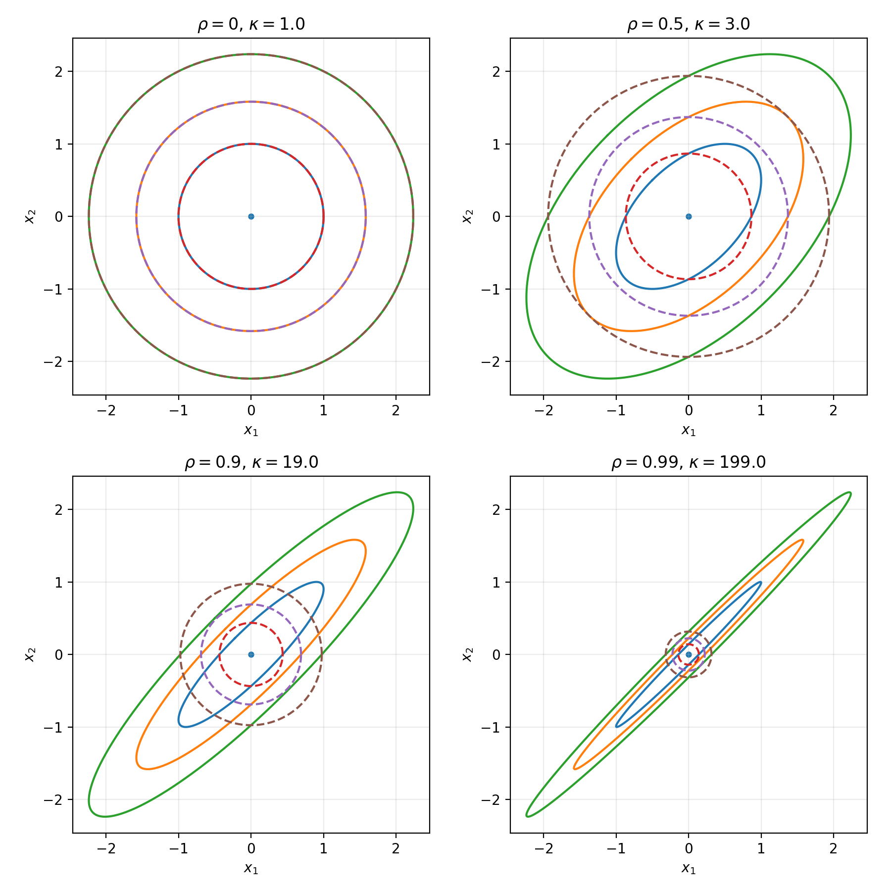
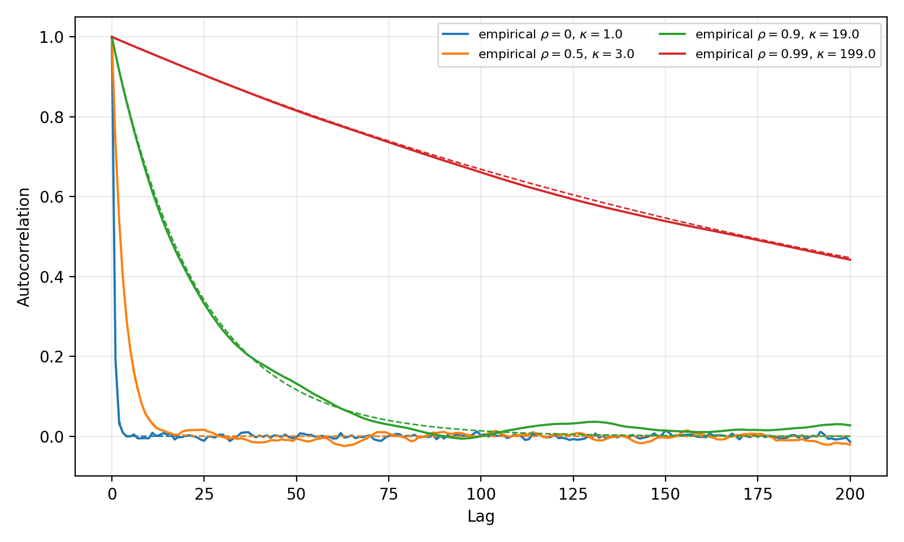
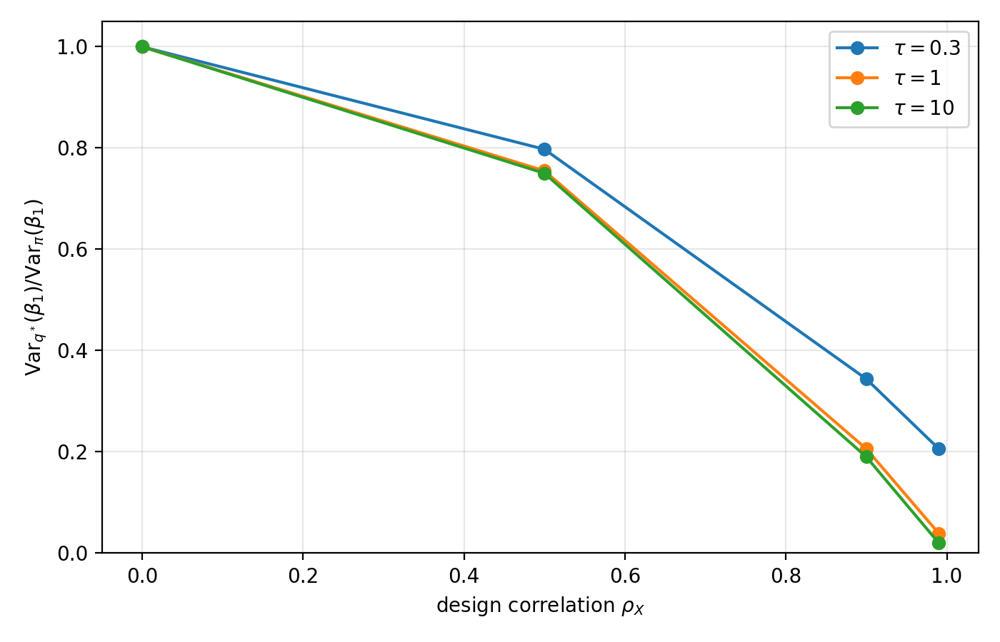

# Posterior Geometry in Variational Inference and Langevin Sampling

[](https://www.python.org/)
[](LICENSE)

How does the same posterior geometry challenge two very different approximation
methods? This repository studies that question in controlled Gaussian settings,
where every approximation can be compared with an exact ground truth.

Mean-field variational inference fails **structurally**: its factorized family
cannot represent posterior dependence. The unadjusted Langevin algorithm (ULA)
fails **dynamically**: anisotropic curvature slows exploration, while Euler
discretization changes the invariant covariance.

## Main result

For a correlated Gaussian target

$$
\pi_\rho = \mathcal N\!\left(0,
\begin{bmatrix}1&\rho\\\rho&1\end{bmatrix}\right),
$$

the forward-KL optimal Gaussian mean-field approximation is

$$
q_\rho^* = \mathcal N\!\left(0,(1-\rho^2)I_2\right),
\qquad
\mathrm{KL}(q_\rho^*\|\pi_\rho)=-\tfrac12\log(1-\rho^2).
$$

As correlation approaches one, mean-field uncertainty collapses while ULA's
slow-direction autocorrelation approaches one.



## Experiments

### 1. Correlated bivariate Gaussian

The first experiment isolates the two mechanisms on four targets with
$\rho\in\{0,0.5,0.9,0.99\}$. It reports the exact mean-field optimum, KL error,
ULA stationary bias, directional autocorrelation and effective sample size.



### 2. Bayesian regression under collinearity

The second experiment embeds the same geometry in conjugate Bayesian linear
regression. A deterministic design gives
$X^\top X=n\left[\begin{smallmatrix}1&\rho_X\\\rho_X&1\end{smallmatrix}\right]$,
allowing collinearity and prior regularization to be varied independently.
It shows how mean-field VI underestimates coefficient uncertainty and how the
same weakly identified direction slows ULA.



## Reproduce the results

```bash
git clone https://github.com/katiarusso/posterior-geometry.git
cd posterior-geometry
python -m venv .venv
source .venv/bin/activate
python -m pip install -e .
python experiments/experiment_1.py
python experiments/experiment_2.py
python -m unittest discover -s tests -v
```

The scripts use deterministic seeds. Generated figures and CSV tables are
written to `results/experiment_1/` and `results/experiment_2/`.

## Repository structure

```text
experiments/   Self-contained experiment scripts
results/       Reproducible figures and numerical tables
tests/         Checks for the closed-form identities used in the analysis
```

## Scope

The goal is not to rank variational inference and MCMC in general. The examples
are deliberately Gaussian, low-dimensional and strongly log-concave so that
structural approximation error can be separated cleanly from dynamical and
discretization effects. Extensions such as full-covariance VI, normalizing
flows, MALA, HMC and preconditioned Langevin dynamics change the trade-offs.

## Technical note on ESS

The analytical quantities reproduce the analytical results exactly. Monte Carlo tables are
regenerated deterministically using independent documented sub-seeds, so the
repository remains reproducible even when a single parameter setting is run in
isolation. Their values may differ slightly from earlier notebook executions
because those shared one evolving random-number stream.

ESS truncates the ACF sum at its first non-positive term. This is a simple
truncated-ACF estimator and should not be confused with Geyer's
paired-autocovariance IPS estimator.

## Citation

If this repository supports your work, please cite the accompanying exploratory report using
the metadata in [`CITATION.cff`](CITATION.cff).

## License

Code is released under the MIT License. The project report remains the author's
scholarly work and is included for reading and reproducibility.
